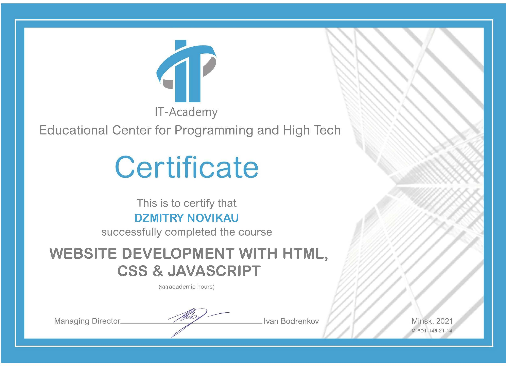

# DZMITRY NOVIKAU

---
##  Contacts:
- ***Location:*** Minsk, Belarus
- ***Phone, Viber, Telegram:*** +375 29 101-37-47
- ***Email:*** novidin@mail.ru
- ***GitHub:*** novidin

## Summary:
System Administrator with more then 10 years experience in information technology with expertise in planning, implementing and supporting IT infrastructure projects. Interested in web development and actively progressing my skills in this direction.

## Personal skills:
- Passionate
- Forward thinking
- Focused
- Hard working

## Skills:
- HTML
- CSS/SASS
- JavaScript (Basic)
- Git
- Gulp
- Adobe Photoshop

## Code example:
```JavaScript
function numberToString(num) {
  return num.toString()
}  
```

## Work experience:
- **2019 - present** Freelance. System administrator. Windows Server(Hyper-V, AD, DNS, DHCP, GPO, Kerio, MDaemon, RDP, 1C 7.7, 1C 8), Linux Debian/Ubuntu, CentOS (Proxmox, Samba, Asterisk/FreePBX. Apache, MySQL), Mikrotik, QNAP. Administration and maintenance websites(HTML, CSS, JS,Bootstrap, Wordpress, Drupal, Joomla, ModX)
- **2010 - 2019** JLLC "Alfa-Kalor" System administrator, since 2012 lead system administrator. Windows Server, AD, DNS, DHCP, GPO, Kerio, MDaemon, RDP, Apache, MySQL, Drupal, 1C 7.7.
- **2008 - 2010** JV "Unibox" Ltd. System administrator. Windows Server, AD, DNS, DHCP, GPO ISAServer, Exchange Server 2k, MS SQL, 1C 7.7
  

## Education:
**University:** Belarusian State University of Informatics and Radioelectronics, Information Technologies and Control in Engineering Systems
**Courses:** IT-Academy


## Language:
English - A2